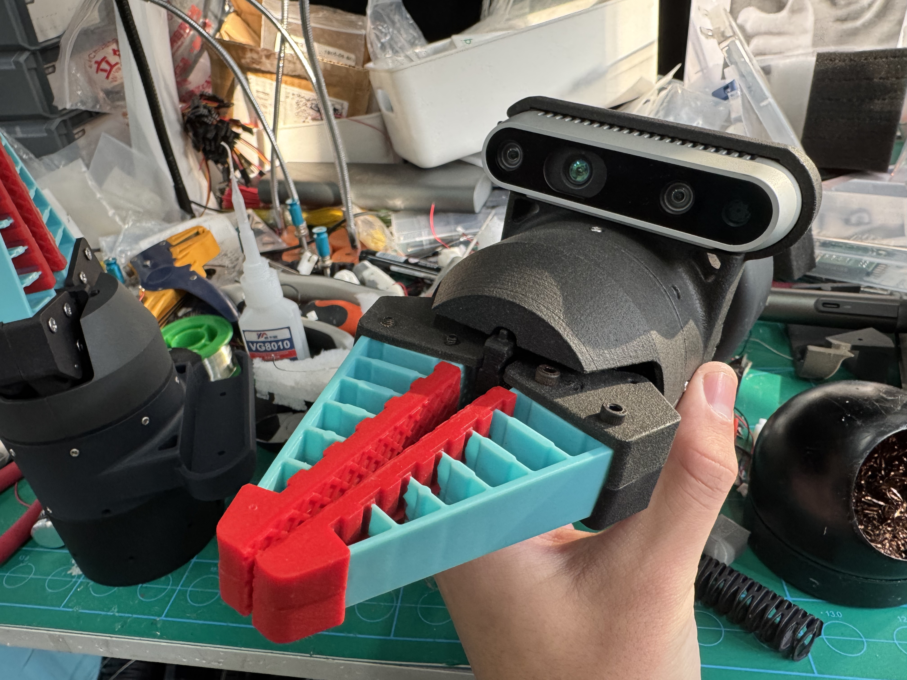
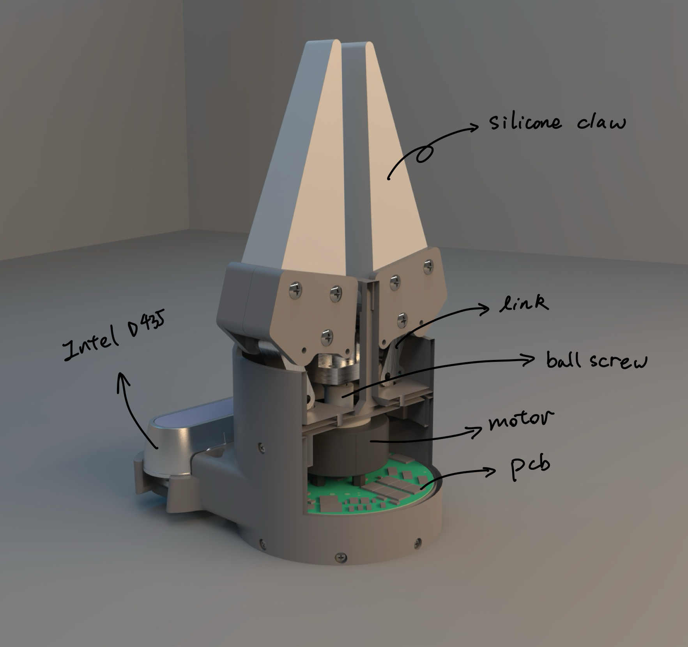
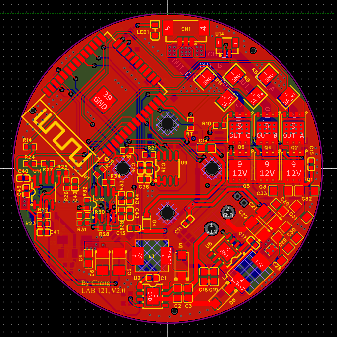
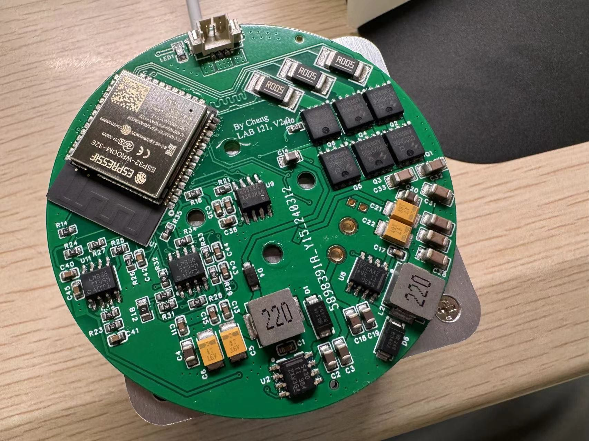

# Choloepus
[](./README.md)
[](./README-zh_cn.md)

## 介绍
Choloepus 是一个使用三相电机驱动的FOC柔性夹爪



## 性能参数

- 可以夹起 3kg 的水
- 可以夹针操作，可以夹起蛋壳（[视频演示](https://youtu.be/MMdkBzw2Btk)）
- 最大驱动电流：2A
- 驱动电压范围：12V ~ 24V
- 支持三种控制模式：力闭环控制（电流闭环），位置闭环控制，力位置混合控制
- 重量：300g

## 机械结构



除去电机和深度相机外，其余所有组件都是自主设计的，可以通过3D打印，基础的机械加工来完成，模型和工程图请见 `/0.Model`

## 电路设计

|  设计要点   | 方案  |
|  ----  | ----  |
| 主控芯片  | ESP32-WROOM-32E |
| 通信  | CAN, TTL |
| 电路层数  | 4层 |
| 驱动方案  | 6颗MOS构成的桥 |
| 电流采样  | 比较放大器放大采样电阻电压 |
| 位置采样  | AS5600霍尔传感器 |
| 驱动电源  | 24V->12V DCDC降压 |
| 控制电源  | 24V->5V DCDC降压, 5V->3.3V LDO降压 |





电路原理图和PCB请见 `./Hardware`

## 固件

本项目固件使用PlatformIO开发，基于Arduino框架

我们在开源项目 [SimpleFOC](https://github.com/simplefoc/Arduino-FOC-drivers) 的基础上做了优化以实现驱动柔性夹爪的FOC控制

固件请见 `./2.Frimware`

## 通信

在Choloepus的底部，有一个XT30的4PIN接口，该接口支持12 ~ 24V的直流电压输入与CAN总线通信

在 `/3.Software` 中，提供了一个Python库用来初始化一个Choloepus对象以建立通信

```python
my_gripper = gripper(serial_port='COM10', id_num=20)
```

Choloepus 支持不同的控制模式，如下表
|控制模式|指令发送频率|可被新指令打断|
|-|-|-|
|位置控制|<250Hz|是|
|力控制|<50Hz|是|
|力位置混合控制|<20Hz|是|

## 视频演示
https://youtu.be/MMdkBzw2Btk

这段视频展示了我们实验室设计的连续体机械臂与Choloepus的配合，完成葡萄缝针的操作。

## 许可证

Choloepus采用AGPL-3.0许可证进行发布。请参考[LICENSE](https://github.com/CassiusXiang/Choloepus/blob/main/LICENSE)获取更多信息。

## 联系方式

我的邮箱: changxiangchina@outlook.com
