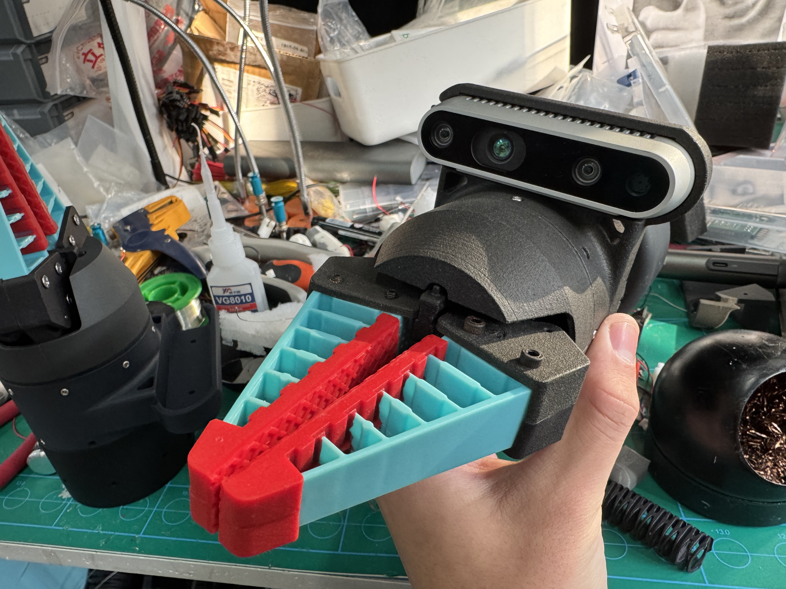
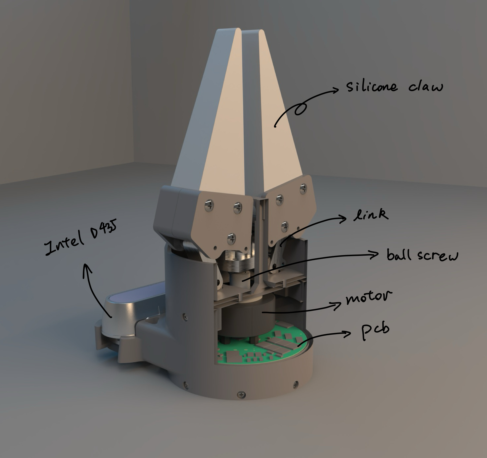
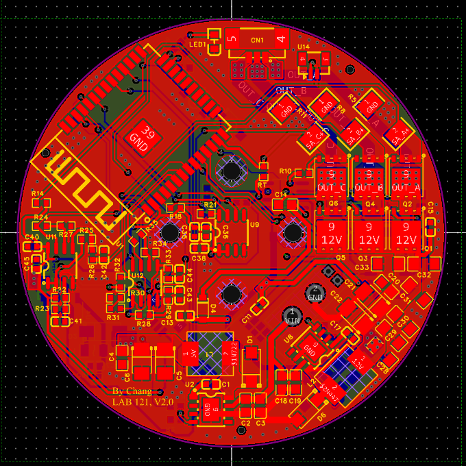
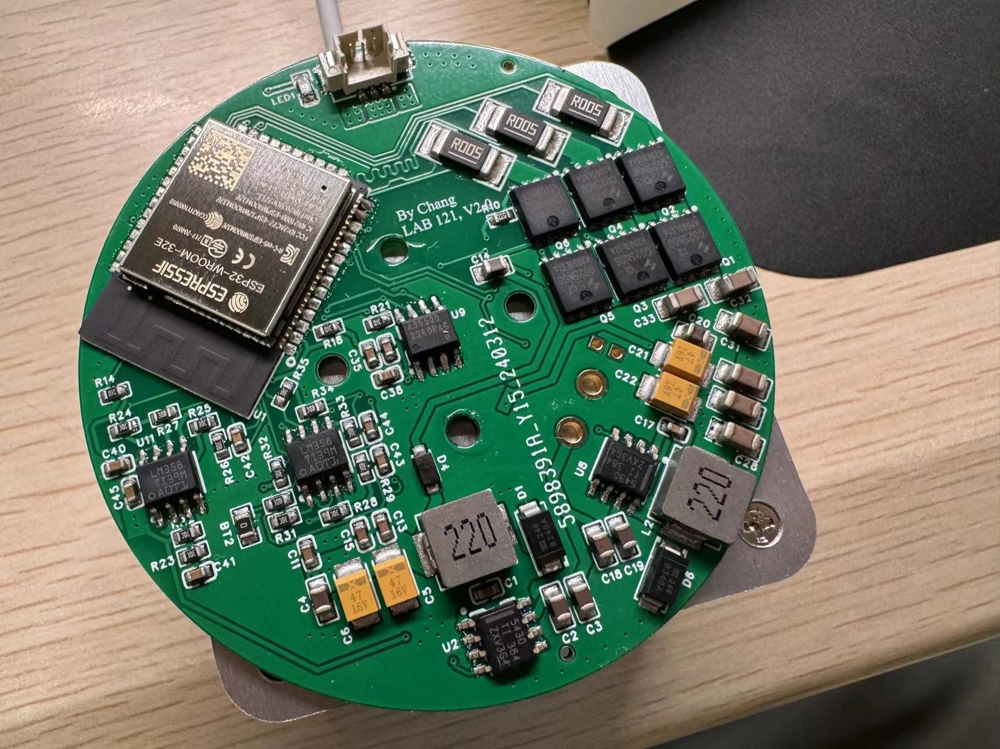

# Choloepus
[](./README.md)
[](./README-zh_cn.md)

## Introduction
Choloepus is a flexible gripper driven by a three-phase motor with Field-Oriented Control (FOC).



## Performance & Features

- Capable of lifting **3kg of water**
- Capable of delicate operations such as **picking up a needle** or **gripping an eggshell** ([video demo](https://youtu.be/MMdkBzw2Btk))
- Maximum drive current: **2A**
- Drive voltage range: **12V ~ 24V**
- Supports three control modes:
  - **Force closed-loop** (current loop)
  - **Position closed-loop**
  - **Hybrid force-position control**
- Weight: **300g**

## Mechanical Structure



Except for the motor and the depth camera, all other components were designed in-house. They can be fabricated via 3D printing and basic mechanical processing. You can find the models and engineering drawings in the `/0.Model` directory.

## Circuit Design

| Key Design      | Details                               |
|-----------------|----------------------------------------|
| Main MCU        | ESP32-WROOM-32E                        |
| Communication   | CAN, TTL                               |
| PCB Layers      | 4 layers                               |
| Drive Method    | H-bridge using 6 MOSFETs               |
| Current Sensing | Comparator amplifier + shunt resistor  |
| Position Sensing| AS5600 Hall sensor                     |
| Drive Power     | 24V -> 12V DC-DC buck                  |
| Control Power   | 24V -> 5V DC-DC buck, 5V -> 3.3V LDO   |





You can find the circuit schematics and PCB layout in `./Hardware`.

## Firmware

This project’s firmware is developed with PlatformIO under the Arduino framework.

We have built upon the open-source project [SimpleFOC](https://github.com/simplefoc/Arduino-FOC-drivers) and made optimizations to drive the flexible gripper with FOC control.

The firmware is located in `./2.Frimware`.

## Communication

At the bottom of Choloepus, there is a 4-PIN XT30 connector that supports a DC input voltage of **12 ~ 24V** and **CAN bus** communication.

In the `/3.Software` directory, you will find a Python library that lets you create a Choloepus object and establish communication:
```python
my_gripper = gripper(serial_port='COM10', id_num=20)
```
Choloepus supports different control modes, shown below:
| **Control Mode**            | **Command Frequency** | **Interruptible by New Commands** |
|-----------------------------|-----------------------|-----------------------------------|
| **Position Control**         | < 250Hz               | Yes                               |
| **Force Control**            | < 50Hz                | Yes                               |
| **Hybrid Force-Position**    | < 20Hz                | Yes                               |

## Video Demo
[Watch the Demo](https://youtu.be/MMdkBzw2Btk)

This video demonstrates how Choloepus collaborates with a continuum robotic arm designed in our lab to perform a grape suturing operation.

## License
Choloepus is released under the **GNU Affero General Public License**, Version 3, 19 November 2007. For more details, please refer to the LICENSE.

## Contact
Feel free to reach out to me at: changxiangchina@outlook.com
